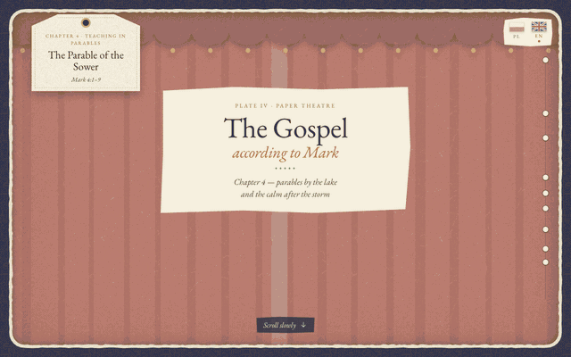

# Ewangelia wg św. Marka — papierowy teatr

Scroll through bible: https://marcinusx.github.io/scroll-through-bible/

[](https://marcinusx.github.io/scroll-through-bible/?lang=en)

A scroll-driven, sentence-by-sentence illustrated reading of the Gospels, drawn as a layered
**paper-cut diorama**. Every sentence is acted out on its own beat, in Polish and English.

* **The Gospel of Mark**: all 16 chapters, from John the Baptist in the wilderness to the empty tomb at sunrise.
* **The Gospel of John**: all 21 chapters, from "In the beginning was the Word" to a world too small for all the books.

Together that's 1,554 verses in 2,767 animated beats across 480 scenes.

The look is heavily inspired by **Mia's AI Lab**, and in particular her paper-cut diorama
[*Foxglove Hollow*](https://miaai-lab.github.io/Claude-Opus-5.5-100-HTML-Files/018-paper-cut-diorama.html)
from her gallery of [100 HTML files made with Claude](https://miaai-lab.github.io/Claude-Opus-5.5-100-HTML-Files/)
([@MiaAI_lab](https://x.com/MiaAI_lab)). Thank you, Mia!

Text:
* Polish: **Biblia Tysiąclecia** (5th ed.), from biblia.deon.pl, in `data/mark.js` and `data/john.js`.
* English: **World English Bible** (public domain), from bolls.life, in `data/<book>-en.js`, with sentence
  splits in each chapter's `beats-en.js`.

## Run

```sh
python3 -m http.server 5178      # any static server works; no build step
open http://localhost:5178/
```

Reading:
* Scroll to move through the sentences.
* Tap the right third of the screen for the next sentence and the left third for the previous one; ← / → do the same.
* The knots on the thread at the right turn the page straight to a section.
* The eyelet on the hanging tag (top left) turns back to the title page.
* Language: the paper flags on the title page, or `?lang=en` / `?lang=pl`. The choice is remembered.
* Deep links: `#w35` jumps to verse 35. Draw a single scene: `?only=storm`.
* Console: `__theatre.go('storm', 7.5)` jumps to scene time 7.5 (beats).

## How it works

* `js/core/engine.js`: the theatre. Scroll position becomes scene time `t` (1 beat = 1 sentence).
  It stacks paper layers, swaps sets between scenes, and drives the caption (word-by-word reveal),
  the hanging section tag, the progress thread and the camera (pan/zoom with per-layer parallax).
* `js/core/paper.js`: the seeded "scissors" (hand-cut polygon edges), paper grain and colour helpers.
* `js/assets/`: reusable cut-outs. `people.js` has puppets with hinged arms, walk, kneel and sit poses,
  plus the Jesus and disciple presets. `nature.js` has hills, water, plants, sun, moon and towns.
  `things.js` has the boat, lamp, bushel, wheat, mustard tree, birds and effects. The palette is in `palette.js`.
* `js/chapters/kit.js`: scene helpers (skies, curtains, crowds, hanging ornaments, flocks).
* `js/chapters/markN/`: one folder per chapter, with one file per scene, a `lib.js` of the chapter's
  own drawings, the English sentence splits and the title-page text. The chapters that are published
  are listed in `js/chapters/index.js` (`READY`); only the chapter being read is loaded.
  See **docs/SCENES.md** for how to write a scene.

### Performance model

Every `L.add()` is its own cut-out. Still pieces get a soft SVG shadow and are rasterised once.
Pieces that move are detected automatically and lifted into small, tightly fitted layers of their own,
with a cheap geometric shadow, so redrawing them never touches the big sheets. Whole-sheet motion
(waves, rain, skies, night falling) uses `L.shift()` / `L.fade()`, which run on the compositor.
Upcoming scenes are pre-built in idle time.

## Tools

* `node tools/check.mjs`: verifies the beats reproduce the Bible text exactly, verse by verse, in both languages.
* `node tools/bench.mjs <url> scene:t …`: frame-time benchmark in a dedicated Chrome window.
* `node tools/shot.mjs <outDir> <url> scene:t … [--size=390x844]`: screenshots of chosen moments.
* `tools/review.sh <chapter> <outDir> [pl|en] [size]`: contact sheets of every beat of a chapter.
* `node tools/record.mjs <url> docs/demo.gif`: records the README tour GIF (needs ffmpeg).
* `python3 tools/fetch_bt.py <book>` / `tools/fetch_web.py <book>`: re-download the Polish / English text.
* `node tools/publish.mjs <book> <chapter…>`: publish chapters (adds them to the book's `READY` list).

## How it was made

Mark 4 was drawn first, together with the engine and asset library. The other 36 chapters of Mark and
John were then drawn in parallel by Claude agents, one per chapter, four at a time, each working from
`docs/SCENES.md`. Every
chapter was reviewed beat by beat from contact sheets (`tools/review.sh`), checked for frame rate, and
validated against the text before it was published.
